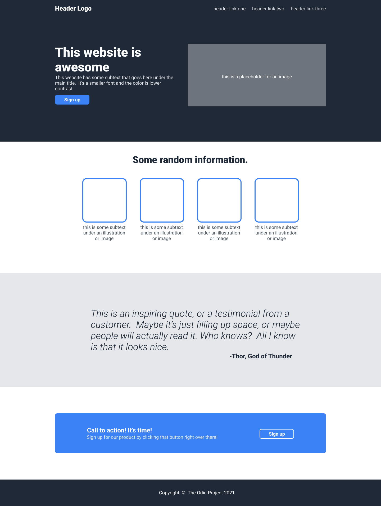

# Landing Page — The Odin Project (Foundations)

A practice project: build one complete web page from a provided design image, part of
[The Odin Project — Foundations: Landing Page](https://www.theodinproject.com/lessons/foundations-landing-page).
The original design ships with dummy content; I personalized it with an **Elaina**
(Wandering Witch) theme using my own images and copy.



## How to view it

- Main page (learning version, evolving commit by commit): open `index.html` in a browser.
- `solution/` version (a clean replica matching the spec, generated with AI assistance as
  a reference): open `solution/index.html` in a browser.
- No build step — plain HTML + a single CSS file (`style.css`).

## Page structure

Following the reference design, top to bottom:

1. **Header + Hero** (dark background `#1F2937`) — logo, 3 nav links, big headline,
   subtext, Sign Up button, and a hero image.
2. **Information** (white background) — heading + 4 image cards with captions.
3. **Quote** (gray background `#E5E7EB`) — a Seneca quote with the author right-aligned.
4. **Call to Action** — a blue `#3882F6` box with a message + button.
5. **Footer** (dark background) — copyright line.

## Design spec used

Source: The Odin Project assignment page.

| Element | Spec |
|---|---|
| Font | Roboto (installed locally, verified via `fc-match`) |
| Dark background (header, hero, footer) | `#1F2937` |
| Logo text | 24px, `#F9FAF8` |
| Hero main text | 48px, `#F9FAF8`, weight 900 |
| Hero subtext + header links | 18px, `#E5E7EB` |
| Buttons + CTA box | `#3882F6` |
| Info heading | 36px, `#1F2937`, weight 900 |
| Quote | 36px, `#1F2937`, weight 300, italic, on `#E5E7EB` |

The layout is built with **Flexbox** (no responsiveness required, per the assignment).

## Repo structure

```
landing-page/
├── index.html            # main page (learning version)
├── style.css             # the single stylesheet for the main page
├── solution/             # clean replica for comparison (index.html + style.css)
├── images/               # images used by the pages
│   ├── elaina-rm-bg.png
│   ├── Elaina Wallpaper (Art).jpeg
│   ├── Elaina.jpeg
│   └── items/            # elaina-i1.jpeg … elaina-i4.jpeg
├── desired-layout.png    # reference design from The Odin Project
└── README.md
```

## What I learned

- Both flexbox axes: `flex-direction: row` vs `column`, and the different roles of
  `justify-content` (main axis) vs `align-items` (cross axis).
- A real-world case of `align-self: flex-start` so the hero button doesn't `stretch`
  to the full column width.
- CSS cascade: a more specific rule (`.author`) only overrides the properties it declares.
- The habit of small, frequent commits with semantic messages (`feat:`, `refactor:`, `docs:`).

## Image credits

The images below are fan art / photos found via Pinterest and used for learning
(non-commercial) purposes. The original creators are most likely the artists whose work
was reposted on Pinterest, not the Pinterest accounts themselves — if you know the
original artist, please let me know so this table can be completed.

| File in repo | Used in | Source | Uploader |
|---|---|---|---|
| `images/elaina-rm-bg.png` | Header logo, favicon | https://id.pinterest.com/CristinaElowen/ | CristinaElowen |
| `images/Elaina Wallpaper (Art).jpeg` | Hero image | https://id.pinterest.com/yen_123412/ | yen_123412 |
| `images/items/elaina-i1.jpeg` | Info card 1 | https://id.pinterest.com/melyssaoctober/ | melyssaoctober |
| `images/items/elaina-i2.jpeg` | Info card 2 | https://id.pinterest.com/melyssaoctober/ | melyssaoctober |
| `images/items/elaina-i3.jpeg` | Info card 3 | https://id.pinterest.com/nviz1on/ | nviz1on |
| `images/items/elaina-i4.jpeg` | Info card 4 | https://id.pinterest.com/ahmadnazullah399/ | ahmadnazullah399 |
| `images/Elaina.jpeg` | Extra stock (not used on the page yet) | https://id.pinterest.com/CristinaElowen/ | CristinaElowen |

> Note: the old README listed `Elaina.jpg` on the first row — the file actually in the
> repo is named `Elaina.jpeg` / `elaina-rm-bg.png`, so the table above follows the real
> file names. For future projects, prefer images with a clear free-to-use license
> (e.g. Pexels, Pixabay, Unsplash) as The Odin Project recommends, and credit the
> photographer plus the license link.

## Planned improvements

- [ ] Replace generic `div.header` / `div.hero` / `div` wrappers with semantic tags
      (`header`, `nav`, `main`, `section`, `footer`).
- [ ] Fix the hero button text contrast and match the CTA blue to the spec (`#3882F6`).
- [ ] Add `object-fit: cover` + descriptive `alt` text to every image.
- [ ] Deploy to GitHub Pages.
